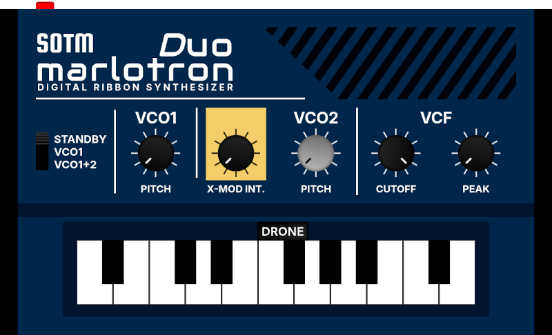

# 🎆 Marlotron Duo Web Synth 🎆
A replica ribbon-based pocket synthesizer built with Web Audio and Tone.js

## ❤️‍🔥💥🌈💫 Browser-Based FM Synthesis 💫🌈💥❤️‍🔥

Explore the sonic territory of FM synthesis from your browser! The Marlotron Duo pays homage to [Korg](https://www.korg.com), aiming to deliver the authentic experience of their [Monotron Duo](https://www.korg.com/us/products/dj/monotron_duo/) pocket synthesizer in a browser environment. The distinctive character of the original hardware has been meticulously recreated based on the electrical schematic, and all parameters have been carefully tuned by ear, using JavaScript, the [Web Audio API](https://developer.mozilla.org/en-US/docs/Web/API/Web_Audio_API), [Tone.js](https://tonejs.github.io/), and math. Many thanks to Korg for the musical inspiration. This project was created for [CS50x 2024](#cs50x-2024-final-project)!



## 🎧 Hardware-accurate emulation 

Based on the audio routing in the hardware’s [schematic drawing](https://www.korg.com/us/support/download/product/0/109/#manual), this emulation aims to capture the nuances of the original analog sound and functionality, including real-time LED feedback showing modulation intensity, and DAW-like zero-latency parameter controls.

### 🎛 Authentic analog architecture
The voice of the synth originates from two voltage-controlled oscillators: VCO1 (the carrier) serves as the primary voice, delivering rich sawtooth waves, while VCO2 (the modulator) features an asymmetric pitch range (-3/+1 octaves), achieving both deep bass modulation and subtle de-tuning. A cross-modulation (X-MOD) system creates sounds ranging from vibratos to extreme FM textures.

## 🎚 Realistic filter design

VCFs are modelled after Korg's famous MS-20 filter, with a classic -12dB/octave lowpass design and peak resonance response matched to their original (20Hz - 8kHz) hardware. Dynamic gain compensation is used to maintain a consistent volume at high resonance at any pitch.

### 🎹 Multi-Mode Ribbon Controller

Closely mimicking the analog voltage divider’s behaviour, the ribbon controller features four play modes which change how the keys are quantized by scale: Chromatic, Major, Minor and Bypass. The continuous pitch keyboard allows for expressive slides, and a drone button has been added to allow for for sustained sounds (note: the drone button is the only synth component that does not exist on the original hardware).

## 📜 User Guide

### 🚀 Getting Started

    1. Power Up: Click any mode other than 'Standby' to start the synthesizer
    2. Play Notes: Click and drag on the ribbon keyboard to play notes
    3. Stop Sound: Release the ribbon or switch to 'Standby' mode
    4. Engage Drone Mode: Press the 'Drone' button to enable sustained notes while tweaking parameters

### 🎛 Main Controls

#### 🔊 Mode Switch

    - Standby: Synth is off, no sound output
    - VCO1: Only the carrier oscillator plays
    - VCO1+2: Both oscillators play audibly together

#### 🎹 Ribbon Keyboard Modes

    - Chromatic: Play all semitones
    - Major: Snaps to major scale notes
    - Minor: Snaps to minor scale notes
    - Bypass: Continuous pitch sliding (no note quantization)

#### 🎼 Drone Toggle

    - Off: Notes stop when releasing the ribbon
    - On: Notes continue playing after release (great for experimenting with parameters)

### 📈 Sound Shaping Controls

#### 🎵 VCO1 Pitch

    - Centre position is base pitch
    - Turn right: Raise pitch up to 1 octave
    - Turn left: Lower pitch up to 1 octave

#### 🎵🎵 VCO2 Pitch

    - Centre position tracks VCO1
    - Turn right: Raise pitch up to 1 octave
    - Turn left: Lower pitch up to 3 octaves (great for bass sounds)

#### ➿ X-MOD Intensity

    - Controls how much of VCO2's signal modulates VCO1
    - Low settings: Subtle vibrato effects
    - High settings: Dramatic FM sounds
    - Effect is more pronounced at higher frequencies

#### 📊 VCF Cutoff

    - Controls the filter's cutoff frequency
    - Turn left: Darker, mellower sound
    - Turn right: Brighter, more present sound
    - Range: 20Hz to 8kHz

#### 🌋 VCF Peak (Resonance)

    - Emphasizes frequencies around the cutoff point
    - Low settings: Subtle filtering
    - High settings: Sharp feedback character
    - Self-oscillates at maximum settings

### 🚨 Live Visual Feedback of Frequency Rates

    - VOC2 dial pulses in response to the active frequencies
    - Faster pulsing indicates higher frequencies

## ⛵ Open Source

I hope that this web synth can serve both as a practical learning tool for web audio synthesis and a fun and playable instrument for anyone interested in sound design on the web.

The codebase is freely available on my GitHub, as I hope others might find it a valuable resource for translating analog synthesis concepts to digital browser-based synthesis. It is thoroughly documented inline with comments to describe the implementation details and to serve as a reference for similar projects. It is designed as a self-contained web component, so you can drop it into your own website to play around!

The code demonstrates several key concepts in web audio programming:

    - Practical application of the Web Audio API and Tone.js
    - Real-time audio parameter handling
    - Musical scale implementation and frequency calculations
    - Event-driven audio programming
    - Hardware emulation techniques
    
### 💻 How to include the synth in an HTML page

1. Copy the whole directory called 'marlotron-duo', which is inside the '/components' directory of this project on GitHub:

2. Inside the <head> element of your HTML, paste the code needed to connect the component to the needed CSS and JS files:
```
<link rel="stylesheet" href="components/marlotron-duo/styles.css">
<script src="components/marlotron-duo/index.js"></script>
```

3. Just above the closing </body> tag of your HTML, paste this <script>:
```
<script>
    document.addEventListener('DOMContentLoaded', () => {
        const container = document.getElementById('marlotron-duo-synth');
        MarlotronDuo.init(container);
    });
</script>
```

## 🧰 Code Guide

### 📦 Directory Structure
```
marlotron-duo/
│
├── index.html             # Main landing page with project description and synth embed
├── main.css               # Global styles for the landing page
│
└── components/
    └── marlotron-duo/     # Self-contained synth component
        ├── index.js       # Component initialization and registration
        ├── template.html  # Synth interface HTML template
        ├── styles.css     # Synth-specific styling
        │
        └── lib/               # Core synth functionality
            ├── dial.js        # Custom dial/knob control implementation
            ├── interface.js   # UI event handling and parameter management
            └── synth-core.js  # Audio engine and synthesis implementation
```   

### 📝 File Descriptions

```
    #### Root Level
        - index.html: Landing page that introduces the project and embeds the synth
        - main.css: Global styles for the landing page layout and typography
        
    #### Marlotron Duo Component
        - marlotron-duo/:
            - index.js: Component initialization and registration
            - template.html: Synth interface HTML template
            - styles.css: Synth-specific styling
            
    #### Library Files
        - marlotron-duo/lib/:
            - dial.js: DAW-like dial/knob control implementation
            - interface.js: UI event handling and parameter management
            - synth-core.js: Audio engine and synthesis implementation
                - Oscillator configuration and audio routing
                - Envelope handling and MS-20 filter emulation
                - Cross-modulation system
                - Musical scale handling
```

### ✨ Audio Signal Path
```
    VCO2 (Modulator)─→[VCA2]────→[Mixer]
    sawtooth               │       │
                           │       │
    VCO1 (Carrier)─→[VCA1]─┘       │
    sawtooth                       │
                                   ↓
                              [MS-20 VCF]
                             -12dB/octave
                                   │
                                   ↓
                         [Filter Compensation]
                                   │
                                   ↓
                             [Destination]
                              (Speakers)
```

### 🪢 Control Signal Path

#### ⚡ Oscillators
```
                        [Ribbon Position]───→[Note Calculator]───→[VCO1 Frequency]
                        │
                        └──→[Base Frequency]
                                ↑
    [VCO2 Pitch Slider]───→[Pitch Scaling]───┬──→[VCO2 Frequency]
    (-3/+1 octaves)                          │
                                             │
    [VCO1 Pitch Slider]───→[Pitch Scaling]───┘
    (±1 octave)
```

#### 🧨 X-MOD
```
    [X-MOD Slider]───→[Exponential Scaling]───→[xModGain]
        (^1.5)              │
                            ↓
    VCO2 Output───────→[VCO1 Frequency]
```

#### 🪩 Voltage Controlled Filters (VCFs)
```
    [VCF Cutoff Slider]───→[Exponential Scaling]───→[VCF Frequency]
    (20Hz - 8kHz)
```
```
    [VCF Peak Slider]───→[Exponential Scaling]───→[VCF Resonance]
    (Q: 0.5 - 50)                                      │
                                                       ↓
                                            [Filter Compensation Gain]
```

#### 🕹 Drone Button
```
    [Synth Mode]───→[VCA Gating]───→[VCA1/VCA2 Gains]
    [Drone Mode]──┘
```

## 🎓 CS50x 2024 Final Project

My journey into learning more JavaScript started out as a [final project](https://cs50.harvard.edu/x/2024/project/) for [CS50x 2024](https://cs50.harvard.edu/x/2024/), and quickly became a deep dive into web audio and synthesis. With serious time constraints, I decided to choose the idea that was most connected to my personal passion for electronic music and how it relates to programming. I had to pick something that would keep me burning the midnight oil as the deadline loomed closer, and FM synthesis was a sure bet.

I aimed to create a JavaScript replica of a small, simple, analog synthesizer I love made by Korg ([the Monotron Duo](https://www.korg.com/us/products/dj/monotron_duo/)) using the [Web Audio API](https://developer.mozilla.org/en-US/docs/Web/API/Web_Audio_API) and [Tone.js](https://tonejs.github.io/), emulating the [hardware specifications](https://www.korg.com/us/support/download/product/0/109/#manual) as closely as possible. I did bite off as much as I could chew without realizing it!

Following my heart allowed me to really engage with JavaScript, learn all about Tone.js and Web Audio API, and completely dissect an FM synthesizer based on its electrical schematic. This is very exciting!

After spending every spare moment fine tuning by ear the ranges of the oscillators and filters and translating that to code and mathematical calculations, I have never felt so intimate with an electronic instrument as I now do with my little synth. CS50 and Korg, thank you!

“Do what you love, you’ll never work a day in your life!”
 ~ [Letterkenny](https://www.youtube.com/watch?v=Z0sq3T5fErQ)

### 🛷 Built with an AI co-pilot

Note that AI was used to create this synth. It would be impossible to comment the code where it was used, since it helped me with everything. From assisting me to debug complex event listeners, to teaching me more concise syntax, to painstakingly reviewing the electrical schematics over and over again, to guiding me with the frequency and modulation calculations, to reviewing the code for best and DRYest practices, Claude 3.5 Sonnet was my invaluable co-pilot.
